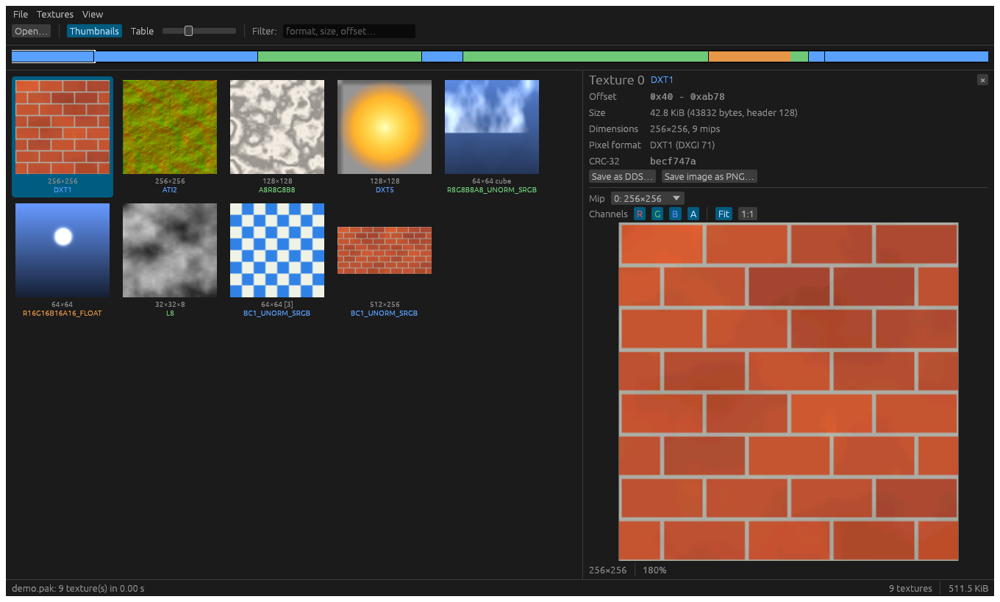
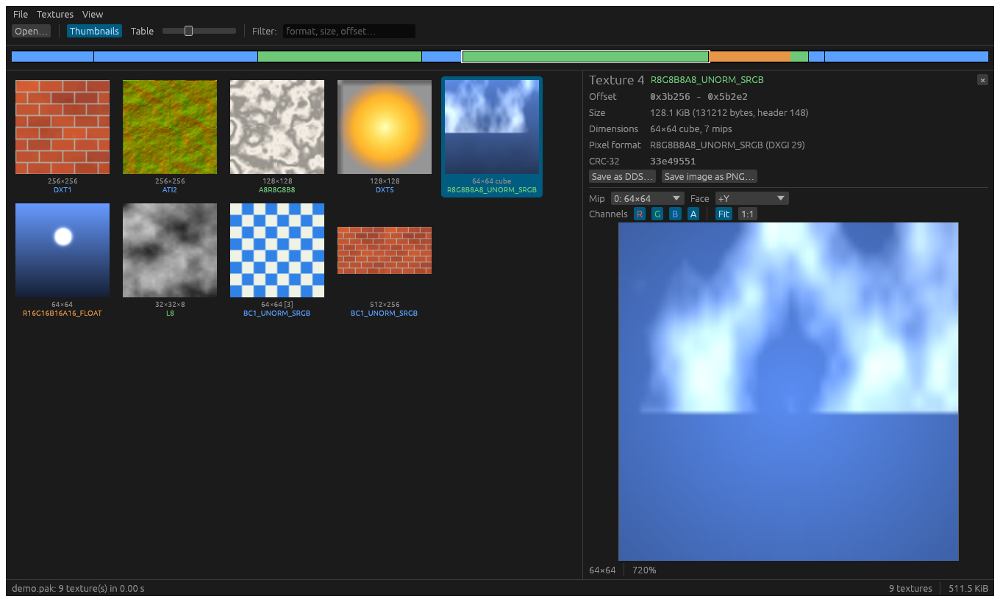
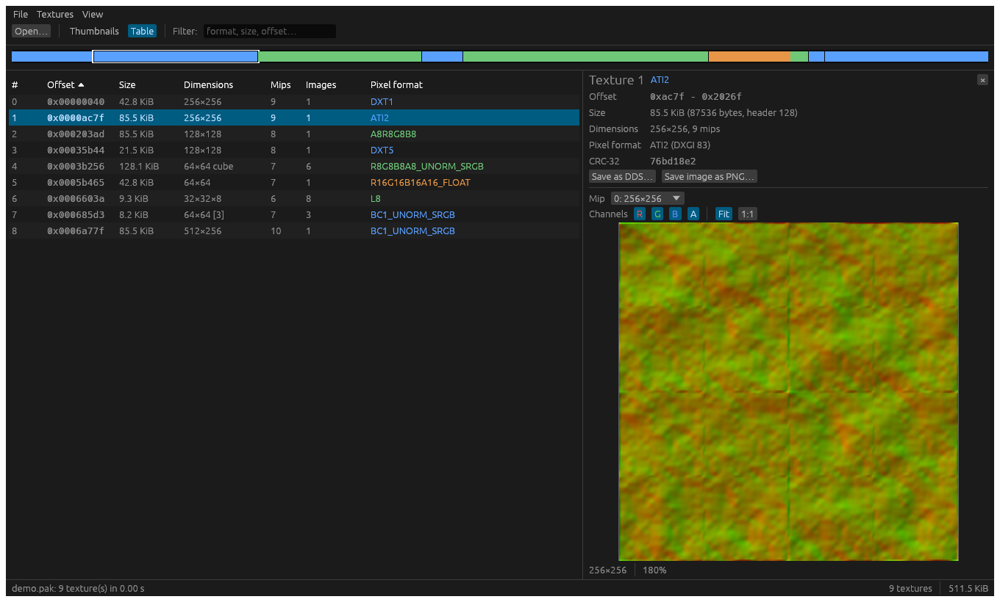

# texscan

Find textures inside any binary file and extract them.

Many games keep standard DDS textures, headers and all, inside their own archive formats. texscan finds them by their headers, works out each texture's exact size from its dimensions, mip levels and pixel format, and writes them out as ordinary `.dds` files. No engine-specific tool needed.

It's a sibling of [zscan](https://github.com/xRopers/zscan), which does the same for compressed streams, and works the same way: a scan writes a JSON manifest, and later steps work from it.

- **Scan** a file for DDS textures, with their exact sizes, dimensions, mips and pixel formats.
- **Extract** them as `.dds` files, or export them as PNG.
- **Pack** edited textures back into a copy of the file, like packzip: edit the PNG (texscan re-encodes it and rebuilds the mips) or drop in a new `.dds`.
- **Browse** them in a desktop app: thumbnails, a sortable table, and a preview with mip, face, slice and channel controls.



**Status: early.** More formats (KTX, PNG and others) are next.

## Build

Rust 1.95 or later (1.89 for the command line alone):

```bash
cargo build --release
```

## Usage

```bash
texscan scan game.pak -o manifest.json      # list textures, write a manifest
texscan extract game.pak -m manifest.json -d textures/
texscan extract game.pak -m manifest.json -d textures/ --png   # also as PNG
# ...edit textures/*.png, or replace a .dds...
texscan pack game.pak -m manifest.json -d textures/ --dry-run   # what would change
texscan pack game.pak -m manifest.json -d textures/             # writes game.packed.pak
```

```
      OFFSET        SIZE  FORMAT  DIMENSIONS          MIPS  PIXEL FORMAT
        0x72       21992  dds     256x128                9  DXT1
      0x567f        4224  dds     64x64                  1  DXT5
      0x66ff        2816  dds     32x16                  3  A8R8G8B8
      0x7204       22020  dds     128x128                8  BC7_UNORM_SRGB
...
```

Every command takes `--json`. The input is never modified. `extract` refuses a file that no longer matches the manifest (`--force` overrides).

`--png` also saves each texture's full-size image as PNG: one file per array element, cube face (`_px`, `_nx`, `_py`, `_ny`, `_pz`, `_nz`) and volume slice. Colours are exported as stored: sRGB stays sRGB, HDR values are clipped to 0–1, and single-channel formats come out grey.

## Putting edited textures back

`pack` looks through the extract folder for textures you changed:

- **An edited PNG** (same size as the texture). texscan encodes it in the texture's pixel format, BC1–BC7 included, and rebuilds its mip levels from it. PNGs you didn't touch are recognised and left alone, so you can export everything and edit one.
- **A replacement `.dds`** with the same dimensions, mip count, faces, array size and pixel format (a DX10 or legacy header both work). Its pixel data is used as is.

Textures keep their exact size and their original header, so nothing else in the file moves and no offsets need fixing. The input is never modified: pack writes a new file (`game.packed.pak` by default), reads it back and checks every changed texture before putting it in place.

Some things can't be written back yet: signed BC4/BC5/BC6H, 4:2:2 video formats, R11G11B10 and R9G9B9E5. A palettized texture can only take colours already in its palette. PNGs are 8-bit, so an HDR texture edited as PNG loses values above 1; replace its `.dds` instead. BC1 is written opaque.

`--show-rejected` lists headers that look like DDS but can't be used, and why (for example an unknown pixel format, or a texture cut off by the end of the file).

## Desktop app

```bash
texscan-gui [FILE]
```

Open a file (or drop one on the window) and it's scanned straight away. Every texture shows as a thumbnail, or as a row in a sortable table; filter by pixel format, size or offset. Click one to preview it:

- pick the mip level, cube face, array element or volume slice;
- turn the R, G, B and A channels on and off (one channel on its own shows as grey);
- fit to the pane, or zoom with the slider or Ctrl + mouse wheel; hover to read a pixel's value;
- save it as `.dds`, or the image shown as PNG.

The strip along the top shows where each texture sits in the file (blue: block-compressed, green: uncompressed, orange: high precision), with headers that couldn't be used marked in red. **Textures > Extract all** saves every texture at once.





The screenshots use made-up textures from `docs/make_demo.py`.

## DDS support

- Legacy headers: DXT1–5, ATI1/ATI2, BC4/BC5, RXGB, RGB, luminance, alpha, bump-map, palettized (P4/P8) and D3D9 float formats.
- DX10 headers: every DXGI format except planar video formats (NV12 and similar).
- Mipmaps, cube maps, volume textures and texture arrays.

Checked against 123 real DDS files covering most legacy formats: each one's size is worked out exactly, and the PNGs match an independent decoder (Pillow) to within rounding wherever it supports the format.

Every format above can be exported to PNG except CxV8U8, planar video formats, depth-stencil formats and most typeless formats.

Textures stored without a header can't be found this way. That includes Unity's Texture2D and Unreal's `.uasset`/`.ubulk`, which keep raw pixel data. A later version will let you describe them by hand.

## License

GPL-2.0-or-later. See [LICENSE](LICENSE).
